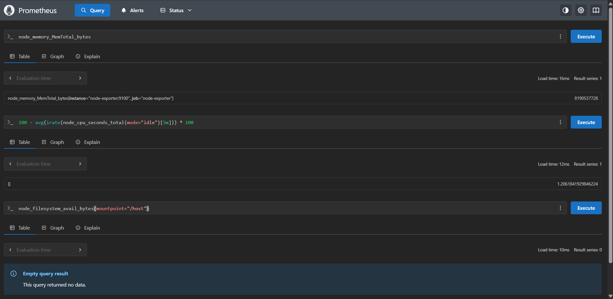
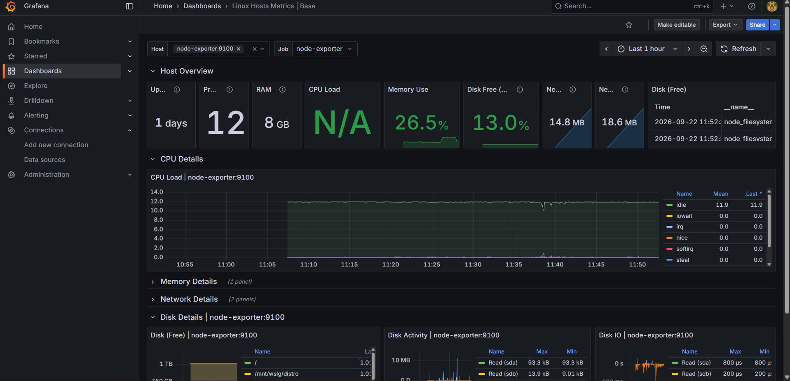

<br/>

<p align="center">
  
</p>

<h1 align="center">Host Monitoring with Prometheus</h1>

<p align="center">
  <i>A machine's metrics exposed by <a href="https://github.com/prometheus/node_exporter">node_exporter</a>, pulled by Prometheus, read in Grafana</i>
</p>

<p align="center">
  <a href="https://github.com/Melvin-Simplon"></a>
</p>

<br/>

<p align="center">
  Nothing here pushes anything. Prometheus decides when to collect, from targets it was told about,<br/>
  and the exporter only answers when asked. That single inversion is what the lab is about.
</p>

<br/>

---

<br/>

## The pull model

Most monitoring people meet first works the other way round: an agent holds credentials, decides when to send, and the backend accepts whatever arrives. Prometheus inverts it. The server holds the target list, the schedule and the retry logic, and a target that stops answering becomes a visible `down` rather than a silence nobody notices.

The consequence is that an exporter is trivial: a process that answers `GET /metrics` with plain text and keeps no state. It needs no credentials, no queue and no knowledge of who is reading it.

<br/>

---

<br/>

## The stack

Three containers on one Compose network, defined in [`docker-compose.yml`](docker-compose.yml).

| Service | Port | Role |
| --- | --- | --- |
| `prometheus` | 9090 | Scrapes the targets, stores the series, answers PromQL |
| `node-exporter` | not published | Reads the host and exposes it as metrics |
| `grafana` | 3000 | Reads Prometheus and draws it |

`node-exporter` publishes no port on the host. Prometheus reaches it over the internal network by its service name, so nothing about the machine is exposed outside Docker.

Each service declares a healthcheck, and Grafana waits on `condition: service_healthy` rather than merely on Prometheus having started. A container that is running is not the same as a container that can answer.

<br/>

---

<br/>

## Measuring the host, not the container

`node-exporter` reports the machine it runs on. Left alone in a container, that machine is the container, and every figure is wrong.

Two settings fix it. The host root is mounted read-only at `/host`, and `--path.rootfs=/host` tells the exporter to strip that prefix back off the labels it emits. Without the flag every mount point would be reported as `/host`, `/host/run` and so on, matching nothing on the real system. With it, the root filesystem is `mountpoint="/"` again.

`pid: host` completes the picture by letting it see the host's processes.

<br/>

---

<br/>

## Running it

```bash
cp .env.example .env          # then set GRAFANA_ADMIN_PASSWORD
docker compose up -d
```

Compose refuses to start if the password is unset, rather than falling back to a default nobody remembers to change. `.env` is git-ignored; `.env.example` records the variable without its value.

Prometheus is on <http://localhost:9090>, Grafana on <http://localhost:3000>.

<br/>

---

<br/>

## What Prometheus is told

Everything the server knows is in [`prometheus.yml`](prometheus.yml): how often to collect, and where from.

```yaml
global:
  scrape_interval: 5s

scrape_configs:
  - job_name: "node-exporter"
    static_configs:
      - targets: ["node-exporter:9100"]
```

The target is a service name, not an address. Docker resolves it on the Compose network, which is why the file needs no editing when container IDs change.

Five seconds is deliberately short for a lab. Real deployments sit at fifteen or thirty, because every target multiplies the write load.

`Status > Targets` in the web UI is where a scrape problem shows itself, long before a dashboard goes blank.

<br/>

---

<br/>

## Reading the metrics

PromQL queries run from the `Query` tab.

```promql
node_memory_MemTotal_bytes

100 - avg(irate(node_cpu_seconds_total{mode="idle"}[5m])) * 100

100 * node_filesystem_avail_bytes{mountpoint="/"} / node_filesystem_size_bytes{mountpoint="/"}
```

CPU usage is derived, not measured: the exporter only counts seconds spent in each mode, so the query takes the rate of the idle counter and subtracts it from one hundred.

Filesystem queries need their mount point pinned. Under WSL the host disk appears as `/mnt/c`, `/mnt/wsl` and friends, and an unfiltered query mixes them into the same graph.

<p align="center">
  
</p>

<br/>

---

<br/>

## Grafana

Add the data source under `Connections > Data sources > Prometheus`:

| Field | Value |
| --- | --- |
| Prometheus server URL | `http://prometheus:9090` |
| Scrape interval | `5s` |

The URL is the one thing that catches people out. Inside the Grafana container, `localhost` is Grafana, so the service name is what resolves.

From there, [KDS Linux Hosts](https://grafana.com/grafana/dashboards/10180-kds-linux-hosts/) (dashboard ID `10180`) imports a full host view off this single data source. Its `Host` and `Job` variables are filled from the labels Prometheus attached at scrape time, which is why one dashboard covers any number of machines without being edited.

<p align="center">
  
</p>

<br/>

---

<br/>

<p align="center"><sub>Brief in <a href="docs/CONSIGNES.md">docs/CONSIGNES.md</a></sub></p>
